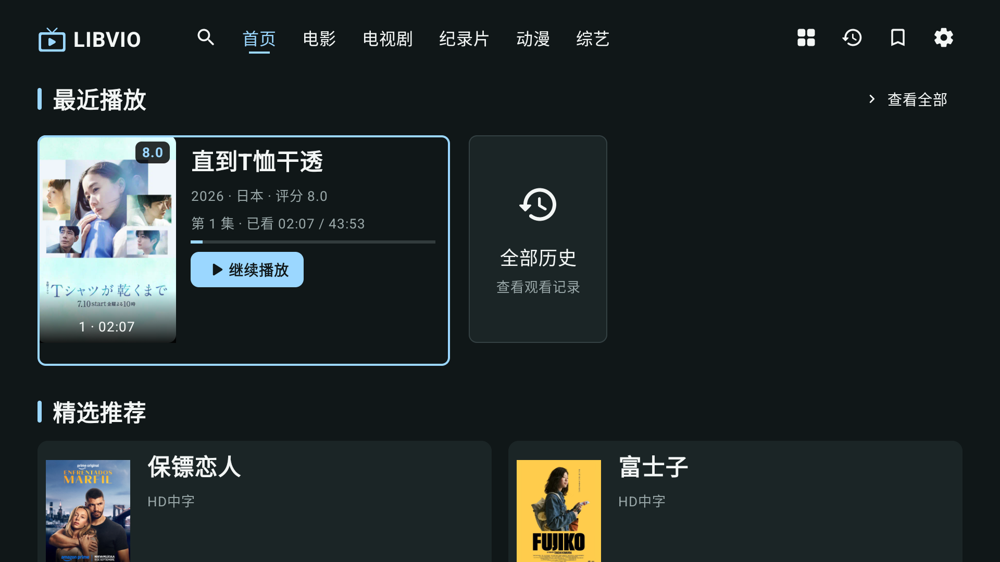

# LIBVIO TV

面向 Google TV / Android TV 的原生客户端。交互和布局沿用 [Olevod TV](https://github.com/abdvl/olevod-tv-app)，焦点、按钮与进度条使用淡蓝色 `#9BD7FF`。

**当前版本：0.1.2-dev 开发原型，加入同线路软件视频解码，尚未正式发布。**

## 已实现

- 无需登录，本机 SQLite 保存观看进度、历史与收藏；本地搜索记录。
- 从 [永久入口](https://libvio.lol/) 发现站点，缓存最后可用地址，提供重新检测、请求失败恢复和手动选站。
- 首页最近五部与展开续播卡、推荐、五类内容；分类人气/评分榜；六列目录、网站实际筛选条件与连续追加。
- 三栏搜索：字母键盘、中文系统输入、本地记录与影片词条、真实搜索结果。
- Media3 原生播放；遇到不支持的编码时先用 libVLC 软件解码同一地址，再尝试其他同集线路。
- 普通/全屏布局、八项控制、十集分组、播放速度和多线路浮层，两种解码方式共用操作和续播记录。
- 依据实际集名匹配换源，保留进度和暂停状态；收到新源首帧后才更新活动线路与记录。



[软解验证](docs/verification/software-decoding/README.md) · [播放修复验证](docs/verification/playback-fix/README.md) · [原型截图与验证范围](docs/verification/prototype/README.md) · [实施进度](docs/EXECUTION_PLAN.md)

## 当前边界

0.1.2-dev 已通过 TV 模拟器的原 HD3 软件解码、连续播放、暂停换源、快进、速度和收藏续播测试，以及原有首页 HLS、HD7/HD2 与 TV 播放控件回归。Chromecast 真机已通过原 HD3 连续软解、全屏切换、收藏续播及首页 HLS 共 4 项回归。32 位 ARM 的软解配置优先保证流畅，可能出现更明显的压缩块；实测证据和长期播放边界见软解验证记录。

原型阶段已在 Android TV 模拟器上验证同一影片的 HD7 / BBA 与 HD2 / rrmj：首帧、暂停、快进、播放中换源、暂停中换源和本地进度。HD2 的部分 HEVC 文件需要 Android 11 / API 30 以上的系统格式解析器；较旧设备可能需要选择 HD7。HD10、其他 provider、真机长期播放、断网恢复、完整遥控器遍历和 1.3 倍字体尚未完成验收。

带有 `encrypt=3` 的已知 Artplayer 线路使用短生命周期 WebView 运行站点解析脚本，在 video 取得元数据后读取直链或其所属播放器的 HLS 清单，立即释放网页，再由原生或软件解码器播放。未知解析方式会提示切换线路。媒体地址不写入历史或项目日志，不提供账号、网盘下载或云同步功能。

## 构建

需要 JDK 17、Android SDK 35。可在 Android Studio 中打开本仓库，或设置好 `JAVA_HOME` / `ANDROID_HOME` 后执行：

```sh
./gradlew assembleDebug testDebugUnitTest lintDebug
```

调试包按处理器架构拆分：`app/build/outputs/apk/debug/app-armeabi-v7a-debug.apk` 适用于本次测试的 Chromecast；64 位 ARM 设备使用 `app-arm64-v8a-debug.apk`，另有 x86 / x86_64 包。通过 `adb shell getprop ro.product.cpu.abilist` 确认目标架构。包名 `com.libvio.tv`，可与 Olevod TV 同时安装。首次配置本机缓存后，可使用 `source scripts/android-env.sh`；`.tools/` 不提交。

Android 测试工程可通过 `./gradlew assembleDebugAndroidTest` 构建。访问真实站点的测试必须显式传入 `-e liveLibvio true`，详见验证记录。正式发布签名、更新检查和 GitHub Release 尚未配置。

## 调研与设计

- [实站调研和播放链路](docs/RESEARCH.md)
- [架构、页面和目标验收设计](docs/DESIGN.md)
- [分步实施计划](docs/EXECUTION_PLAN.md)
- [视觉参数](docs/design/tokens.json)
- [初始研究验证记录](docs/verification/2026-09-12.json)

仅检查公开 HTML 的 Python 调研工具独立保留：

```sh
python3 -m unittest discover -s tests -v
python3 scripts/probe_site.py --live --detail-path /detail/5813548.html --limit 3 --output .tools/research/latest.json
```

## 许可

应用代码采用 [MIT License](LICENSE)。复用的 Olevod 组件保持原 MIT 许可；libVLC 等依赖保留其各自许可，详见 [第三方软件说明](THIRD_PARTY_NOTICES.md)。影片、海报和网站品牌资产的权利归各自权利人；代码许可不涵盖这些内容。当前应用使用独立绘制的临时 TV 图标。
