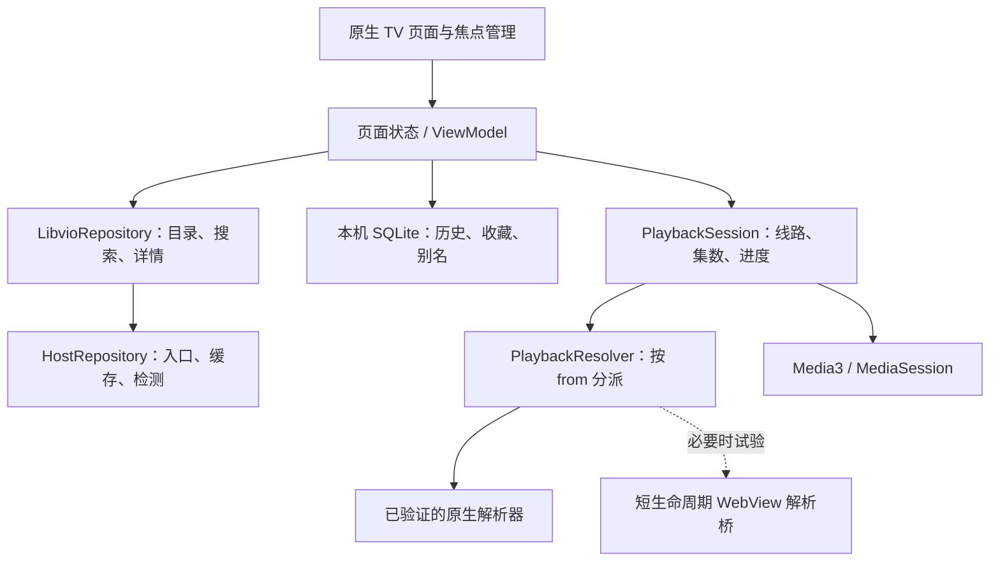

# LIBVIO TV 实现设计

状态：目标设计基线；Android 开发原型已实现，具体完成情况以 EXECUTION_PLAN 和原型验证记录为准。目标设备：Google TV / Android TV，横屏、遥控器优先，无账号依赖。

## 1. Olevod 复用原则

本轮已读取 Olevod 当前本地提交 `0fec7424e1d761373e00c52c0c816e09a42cf4fe` 的实际 Kotlin 实现。以实际交互、当前代码和用户要求为准，旧 `tokens.json` 中个别数值已落后于代码（例如分类榜已为 12 项、剩余 10 张五列两行）。

先复制可复用组件到 LIBVIO 仓库，保留原 MIT 许可；不要立刻把两个 App 改成共享大工程，以免影响现有 Olevod 发布。

| Olevod 文件 / 能力 | LIBVIO 处理 |
| --- | --- |
| `TvDesign.kt`、`UnifiedHeader`、`PosterCard` | 复用焦点、尺寸、图片和标题规则，替换品牌与主色 |
| `FocusRestoration.kt`、`PageFocusController` | 复用按页面/区块/影片保存和恢复焦点，避免跨页请求抢焦点 |
| `ConnectedHome.kt`、`HistoryRecordCard.kt` | 复用首页最近五部、展开信息、全部历史入口 |
| `MiniCategoryHome.kt`、`MiniRankingScope.kt` | 复用人气/评分榜结构，替换分类和排序参数 |
| `ConnectedBrowse.kt`、`CatalogFeed.kt`、`FilterPopovers.kt` | 复用滚动追加与筛选浮层，数据源和维度改为 LIBVIO |
| `ConnectedSearch.kt` | 复用键盘/词条/结果三栏和焦点行为；重新实现搜索请求与词条来源 |
| `NativePlayer.kt` | 复用 Media3 生命周期、暂停保存、轨道信息；新增播放解析和多线路会话 |
| `PlayerContent.kt`、`PlayerVideoStage.kt`、`PlayerKeyInput.kt` | 保留八个控制按钮、普通/全屏布局、按键与覆盖层行为 |
| `EpisodePicker.kt`、`PlaybackResume.kt` | 保留十集分组；增加线路维度与跨源集数匹配，不能原样套用旧索引 |
| `HistoryStore.kt` | 复用本地 SQLite 思路，去掉账号 scope / 云同步，增加影片别名与线路信息 |
| 收藏、设置、退出确认 | 收藏转本地；设置加入 host；退出确认默认继续观看 |
| `OlevodApi.kt`、登录/会员/云历史/验证码 | 不移入新应用；另写 `LibvioRepository` |
| Olevod 更新器、签名配置、Logo | 不直接复制到 LIBVIO。后续更新仓库、包名、发布资产独立配置 |

## 2. 页面与淡蓝色主题

色彩和参数见 [tokens.json](design/tokens.json)。`#9BD7FF` 替代 Olevod 的绿色焦点色；原有深色底、正文、面板、错误与警告色保持。焦点边框、按钮填充、当前项下划线、进度条和正在播放集数统一使用淡蓝色。

基础规则保持：960×540 dp 逻辑画布、左右 36 dp 安全区、64 dp 顶部导航、列表底部 64 dp 留白、2 dp 焦点边框、2:3 完整竖海报 `Fit`。焦点、已选中、正在播放三个状态分开，不用海报放大挤压布局。

导航顺序：

`LIBVIO 标识 → 搜索 → 首页 → 电影 → 电视剧 → 纪录片 → 动漫 → 综艺 → 目录 → 历史 → 收藏 → 设置`

这是按网站真实分类对 Olevod 导航内容的必要替换，账号、VIP、短剧入口不强行照搬。专题留到后续版本，不影响先完成主要看剧流程。LIBVIO 标识取本站资产并独立记录来源；不把 Olevod Logo 或它的宽高比直接换名字使用。

| 页面 | 目标行为 |
| --- | --- |
| 首页 | 默认聚焦首页；第一节最近播放：五部＋全部历史，显示集数、已看时间，焦点展开不推挤下一节 |
| 推荐 | 有真实内容横幅时使用；当前未验证影片横幅来源，先以完整海报＋旁侧片名组成宽卡。广告图片不能当推荐素材 |
| 各分类 | 人气和评分各取前十二，前二突出，后十张五列两行，末尾浏览全部；当前年份和全部年份切换沿用 Olevod 实践 |
| 目录 | 分类切换＋排序/类型/地区/年份/语言，弹层确认应用；底部追加下一页，无翻页按钮 |
| 搜索 | 左键盘、中词条、右结果；中栏先用本地搜索历史及已获取真实影片标题。本轮未验证联想接口，不生成假的热门词 |
| 搜索提交 | 中文系统输入可用；确认后提交站点表单；返回先到输入区；过时结果不抢焦点。由于限频未明，初版不逐字联网搜索 |
| 播放 | 点击影片直接进入播放器路由，加载详情后遵循 Olevod 默认全屏；退出全屏回普通播放布局，不新增独立详情中间页 |
| 普通播放 | 视频左、简介右、控制及选集在下；简介限高；控制区上键到视频，确定全屏 |
| 历史 | 海报、片名、线路、集数、时间和进度；续播、删除、清空。空状态有浏览入口 |
| 收藏 | 本机增删，与历史分别持久化；无登录、云同步或权限提示 |
| 设置 | 当前站点、检测候选、自动/手动选站、应用版本；后续添加独立版本更新 |

## 3. 多线路播放器

维持 Olevod 八项一行：`全屏 / 播放暂停 / −30秒 / +30秒 / −5分钟 / +5分钟 / 速度 / 收藏`。

新增“线路：HD7”等入口放在播放器标题/状态区域，打开专用浮层；不挤掉八项控制，不增加永久占高的多行线路栏。普通与全屏都可打开；焦点上下关系和 1.3 倍字体需要截图验证后确定具体位置。

- 左右/上下移动线路焦点仅浏览。确认另一条源才发起切换，显示源名、集数覆盖、当前播放标记及本次错误状态。
- 切换前保存当前影片、语义集数、位置、暂停状态、速度。优先匹配规范化集数名称；同一影片中的 `第01集` 与 `1` 可建立明确映射，电影的 `1080P` 不解析成集数。
- 不把 `sid` 或列表下标当全局稳定线路身份。保存 `from`、标签、sid 提示和实际播放路径，重新进入时以当前详情确认。
- 若目标源缺少该集，显示“此线路没有当前集”，让用户选集；不悄悄从第一集覆盖原记录。
- 不同版本存在片头/剪辑差异时，位置只能尽量继承；时长差异明显时保留原记录并显示提示，允许手动调整。
- 解析成功并收到新视频首帧后才更新活动线路。失败保留旧历史，提供重试和另选线路；下一集从新源自己的集数列表选取。
- 全屏覆盖层保持视频几何尺寸；选集十项分组，选组不播放，选具体集才播放。打开线路浮层时暂停控制栏自动隐藏。
- 媒体错误先有界重解析一次；失败后提示换源。初版不在用户毫不知情时无限轮换。

## 4. 数据和模块边界

建议沿用 Olevod 当前构建栈：Kotlin、Compose、TV Material、Coroutines、OkHttp、Coil、Media3、本地 SQLite，HTML 解析增加 Jsoup。包名为 `com.libvio.tv`，工程名 `LibvioTV`。首次构建先复用已验证的依赖版本；新增 Jsoup 版本在接入时查官方发行说明并锁定。

核心模型：

| 模型 | 关键字段 |
| --- | --- |
| `SiteHost` | origin、发布页来源、检查时间、最后成功时间、失败原因 |
| `Movie` | 本地稳定键、routeId、已验证 internalId、详情路径、标题、海报、年份、地区、分类、评分及出处 |
| `MovieAlias` | routeId / internalId → 稳定键；记录建立映射的上下文 |
| `PlaybackSource` | 显示名、provider/from（可延迟取得）、sid 提示、online/download/unsupported、episodes |
| `Episode` | 源内 nid、原始 label、经过确认的语义集数、实际 path |
| `ResolvedMedia` | HTTPS URL、MIME/容器、按 origin 限定的请求头、字幕（可选）、解析时间、到期信息（如可知） |
| `WatchRecord` | 稳定影片键、展示快照、来源身份、集数身份、positionMs、durationMs、updatedAt；不含媒体 URL |
| `PlaybackAttempt` | 请求代次、host 版本、影片/源/集身份，用于取消和拒绝过期回调 |

所有页面只接收结构化数据和明确错误类型，HTML 选择器、站点 URL 和播放器解码不进入 Compose 布局。host 缓存失效不删除本地观看数据。

进度沿用每 10 秒保存，暂停、切集、换源、后台和退出时补存；所有写入绑定实际活动媒体身份。完成附近的续播阈值沿用 Olevod（最后 10 秒按已完成处理），自动下一集从新一集 0 开始。解析失败和未出首帧的尝试不把既有记录改成 0。

## 5. 验收标准

1. 初装免登录；永久入口发现 host；入口离线/旧 host 失效可恢复；全部失败仍能看到本地历史。
2. 首次影片真实出首帧且持续播放；每种已支持 source provider 分别验证。媒体状态包含真实时长、暂停、跳转和清晰度。
3. 同影片换源保持集数/进度；不同集数列表、源下架、解析过期、连续快速选择和过期回调不串片、不覆盖历史。
4. 杀进程重启、断网、后台恢复、换 host 后历史和收藏均保留；过期播放 URL 重新取得。
5. 遥控器完成首页、目录、筛选、搜索、播放、选源、选集、历史、收藏、设置；返回列表恢复原海报和滚动位置。
6. 普通/全屏保持单一播放器；覆盖层不缩小视频；只有一个焦点；最后一行海报、标题、焦点框完整可见。
7. 截图分别检查 960×540 dp 逻辑布局、1080p 输出和 1.3 倍字体。先交早期真实截图，再做逐页修正。
8. 单元测试和模拟器通过只算本地验证；Google TV / Chromecast 实机的首帧、快进、换源、长播和遥控器验收单独记录。

实施顺序见 [EXECUTION_PLAN.md](EXECUTION_PLAN.md)。
