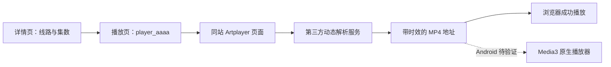

# LIBVIO 实站调研

日期：2026-09-12。范围：公开网页、桌面浏览器交互、公开播放器配置和视频网络响应。

结论：适合做独立的 Google TV 原生客户端。内容浏览和本地数据比 Olevod 简单；播放地址的动态解析需要单独验证，不能把现有 Olevod API 换一个域名就直接使用。

**这是调研结果，不是 Android 播放验收或已完成的 App。** 本轮没有生成 APK，也没有在 Google TV 真机上测试。

## 1. 已验证的路径

| 项目 | 观察 | 证据与限制 |
| --- | --- | --- |
| 永久入口 | 列出 `.cam`、`.lat`、`.bid`、`.dev` | [libvio.lol](https://libvio.lol/)；当前列表，不保证各地网络都能访问 |
| 当前站 | `.lat` 首页、详情、目录和搜索可访问 | 浏览器操作与独立 HTTP 页面读取均成功 |
| 镜像 | `.cam/detail/5813548.html` 与 `.lat` 显示同一片名和三条在线线路 | 只核对这部剧；未验证 `.cam` 视频播放、`.bid`、`.dev` 可用性 |
| 分类 | 电影 1、电视剧 2、纪录片 3、动漫 4、综艺 5；另有专题 | 分类 ID 与 Olevod 不同，例如 3 在 Olevod 是综艺 |
| 目录 | 类型、地区、年份、语言、排序；排序为时间、人气、评分 | [电影目录](https://www.libvio.lat/show/1-----------.html)，当前每页 12 部，有下一页链接 |
| 搜索 | POST 表单字段 `wd`，提交中文“流浪地球”返回影片 | [搜索表单](https://www.libvio.lat/search/-------------.html)；URL 不带词，网页标题中的查询词可能为空 |
| 剧集 | 3 条在线候选线路各 10 集，以及 3 条网盘下载 | [样本详情](https://www.libvio.lat/detail/5813548.html) |
| 电影 | BD1、BD2、HD7 及夸克；集数标签可为 `1080p` | [电影样本](https://www.libvio.lat/detail/5811477.html)；本轮未播放这个电影样本 |
| HD7 | `from=BBA`、`sid=4`；浏览器出现正片画面，时间由 00:08 走到 01:08，总时长 43:53 | [HD7 首集](https://www.libvio.lat/play/5813548-4-1.html)，视频响应 HTTP 206 |
| HD2 | `from=rrmj`、`sid=6`；浏览器播放器显示 00:23 / 43:53，视频响应为 `video/mp4`、HTTP 206 | [HD2 首集](https://www.libvio.lat/play/5813548-6-1.html) |
| HD10 | `from=NBY`、`sid=5`，成功读取播放配置 | [HD10 首集](https://www.libvio.lat/play/5813548-5-1.html)；没有验证视频 |

读取公开首页得到 60 个去重后的影片卡片。这个数量是采样结果，不是首页永久固定数量。站点本轮未要求登录；不能据此承诺未来没有站点验证或临时限制。

## 2. 网页数据契约

页面带有 MacCMS 风格的 `player_aaaa` / `MacPlayer` 和 `stui-*` 结构。此判断来自当前页面代码；本轮没有发现并验证可直接替代网页解析的稳定公开 JSON 目录 API。

| 能力 | 当前路径 / 字段 | Android 实现建议 |
| --- | --- | --- |
| 入口发现 | 永久入口中“目前可用地址”下的 HTTPS 链接 | 独立 `HostRepository`；缓存最后成功列表 |
| 首页 | `/`；`a.stui-vodlist__thumb`，`title`、`data-original`、`href` | Jsoup 解析片单和区块，Coil 加载原始海报 |
| 分类小首页 | `/type/{id}.html` | 能力与片单结构需在实现时补测 |
| 筛选目录 | `/show/1-----------.html` 及页面实际筛选链接 | 优先跟随页面提供的链接，保留筛选上下文 |
| 排序示例 | `/show/1--hits---------.html`、`/show/1--score---------.html` | 人气、评分分类榜可由目录查询构建，组合条件需要补测 |
| 分页 | `/show/1--------2---.html`；“下一页”锚点 | UI 继续使用滚动追加，每个列表同时最多一个请求 |
| 搜索 | POST `/search/-------------.html`，`wd=<关键词>` | App 自己保存提交词；搜索分页、限频和零结果需补测 |
| 详情 | `/detail/{routeId}.html`；`h1.title`、`.stui-content__detail`、`.detail-content` | 提取真实片名、元信息、完整简介，保留缺失值 |
| 评分 | 详情包含豆瓣链接和站点展示的分数 | 标明“站点展示的豆瓣评分”；0.0 当作暂无评分，不冒充实时豆瓣查询 |
| 线路和集数 | `.stui-vodlist__head h3` 与后续 `ul.stui-content__playlist` | 保留展示顺序；每条线路有独立选集列表 |
| 播放页面 | `/play/{routeId}-{sid}-{nid}.html` | 保留实际链接，不能用显示位置推导 sid |
| 播放配置 | `player_aaaa` 中 `id`、`sid`、`nid`、`from`、`encrypt`、`url` | 仅解析 JSON 数据；`url` 不是已解析的视频直链 |

不要把所有 `<a>`、图片或 iframe 都当作影片或播放器。页面中有广告、外跳、下载、备用空 iframe。生产适配器应按内容容器和链接类型识别。

### 影片身份不能简单截断

同一部剧：公开详情/播放链接使用 `5813548`，播放器 JSON 的内部 `id` 是 `3548`，其 `link_next` 也使用短 ID。网站当前同时存在这两套标识。

- 分开保存 `routeId`、`internalId` 和解析得到的别名关系；不要硬编码“减去 5810000”或截掉固定前缀。
- 本地记录的稳定身份不包含 host；换站时重建内容页面请求，重新获取播放配置。
- 只有同一详情/播放上下文提供的对应关系才合并记录；片名或标签相同不足以合并。
- `.cam` 与 `.lat` 的当前样本匹配支持这一设计，但尚未验证未来全部镜像、历史影片和链接别名。

### 在线源与下载源

剧集样本的显示顺序是 HD7（sid 4）、HD2（sid 6）、HD10（sid 5），然后 UC（sid 3）、夸克（sid 1）、百度（sid 2）。

“立即播放”链接指向 sid 1，在这部剧中就是夸克合集。App 必须选择在线源，不应盲目跟随该按钮。另一部电影的 sid 1 又是在线 BD2，说明不能用固定 sid 判断网盘。

当前探针按组标题标记 `online_candidate` / `external_download`；正式实现还需结合该组 `from` 和解析结果确认可播放性。未知线路明确显示不可用或待验证，不能显示“已支持”。

电影选集中的 `1080P` 是显示标签，不是第 1080 集；HD7、HD2、BD1 也不是可靠的真实分辨率。分辨率与码率继续取播放器实际轨道。

## 3. 播放链路与首要风险

本轮观察到的链路：



三个剧集源的 `encrypt` 均为 3，`url` 是不透明内容。HD7 和 HD2 都加载 `/static/player/artplayer/`，随后请求 `hd.ticktockwow.com/smartplay-cache/api/webvideo_ty.php`，再访问不同视频 CDN。其页面还包含混淆脚本和动态参数。

因此：

1. 优先验证可维护的原生解析：只支持已确认的数据转换/请求契约，不猜解密规则，不执行从网站下载的任意代码。
2. 如果当前脚本不能稳定地直接适配，试验独立、短生命周期的 WebView 解析桥，取得本次选集的媒体地址与必要请求头，交给 Media3。页面内容仍全部由原生 TV 组件呈现。
3. WebView 方案目前只是候选设计。是否可在目标 Google TV 的 WebView 上执行、获取正确媒体、停止网页播放并交给 Media3，需要真实设备验证。桌面 Chrome 成功不能代替这一步。
4. 测试必须识别正片，不能把遇到的第一条媒体请求当作正片；`blob:` 也不能直接交给 Media3。只拿到 HTTP 200/206 不代表成功，需要首帧、时长和持续播放证据。
5. 媒体 URL 只保存在当前播放会话。每次重新打开影片/过期重试都重新解析，不把带签名地址写进历史、日志、仓库或长期缓存。
6. `Referer`、`Origin`、User-Agent、Cookie 的实际要求尚未完成原生验证；按源配置和实际 origin 限定，不能把 Olevod 的固定 Referer 或某站 Cookie 全局传给其他 CDN。

Media3 支持 MP4、HLS 等容器/传输形式；具体音视频解码仍取决于设备。[Android 官方格式说明](https://developer.android.com/media/media3/exoplayer/supported-formats)。本轮只观察到两条 MP4 视频链路，没有验证本站 HLS、4K、HDR、外置字幕或音轨切换。

WebView 的 JS 与原生交互应限制在必要范围：独立实例、禁止文件访问与任意外跳、不暴露广泛原生接口，结束解析时停止加载并释放。未来域名由受验证的发布页/播放器来源更新，不硬编码整个互联网为可信来源。[Android WebView 文档](https://developer.android.com/develop/ui/views/layout/webapps/webview)。

## 4. 站点发现建议

- 初装读取 `https://libvio.lol/`。先尝试用户指定的 `.lat`（前提仍在列表），再尝试列表其他站点；有历史时优先最近成功站。
- 可用性至少验证 TLS、最终站点、HTTP 状态、LIBVIO 导航和实际影片卡片。200 的验证页/停车页也要判失败。
- 缓存最近成功 host 和经过验证的候选列表。建议每 24 小时后台刷新一次，站点请求失败时允许提前刷新；这是初始设计参数。
- 候选并发最多 2 个；每次失败恢复只完整走一轮候选，避免无限切站。具体超时先以实机采样调整。
- 保留设置里的“当前站点 / 自动选择 / 重新检测 / 手动选择候选站点”；显示检测结果，手动选择也先检查。
- 入口临时离线但旧站仍健康时，继续使用旧站；全部失败时保留本地历史并显示重试入口。
- **站点失败与媒体线路失败分开处理。** 视频 CDN 出错先重新解析或换线路，不让每个缓冲错误都触发全站切换。
- 站点切换发生在新内容请求边界。正在播放的有效视频保持当前会话，缓存和异步响应用 `hostGeneration` 区分，丢弃旧请求结果。

## 5. 可重复检查与证据边界

```sh
python3 -m unittest discover -s tests -v
python3 scripts/probe_site.py --live --detail-path /detail/5813548.html --limit 3 --output .tools/research/latest.json
```

探针只使用 Python 标准库。默认不联网；`--live` 后读取入口、一个首页、一部详情、最多三条在线候选源的首集配置。`--query '流浪地球'` 可增加一次公开搜索表单检查。它不执行播放器脚本、不下载视频，输出也不包含播放 URL 或 Cookie。

离线测试涵盖发现区域、域名过滤、去重、分页、线路顺序与 sid 不同、网盘分类、电影标签、内部 ID、拒绝脚本求值及错误结构。合成测试 HTML 是最小契约样本，不是完整网站快照，也不能证明 Jsoup/Android 端已实现。

本轮具体结果见 [观察记录](verification/2026-09-12.json)。浏览器读到的当前事实优先于搜索引擎可能滞后的网页缓存。

还需验证：所有源类型及线路失败行为、搜索分页/限频/空结果、筛选组合、专题、镜像实际故障切换、Android 上的动态解析与原生首帧、真正的遥控器操作和长期播放。
