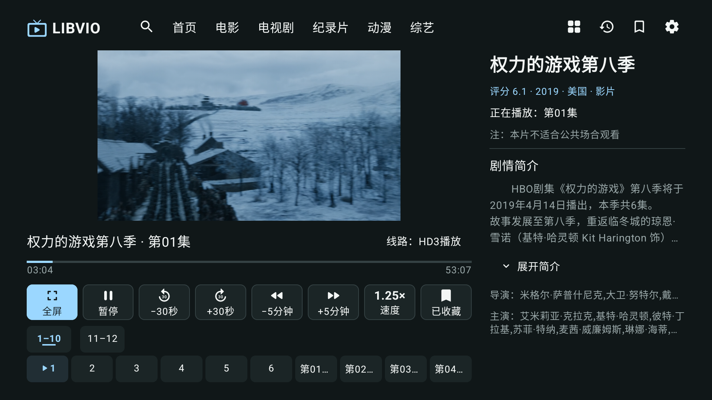
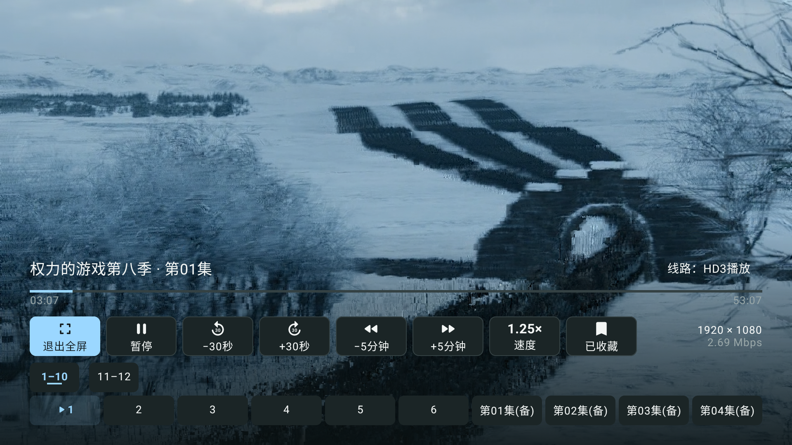
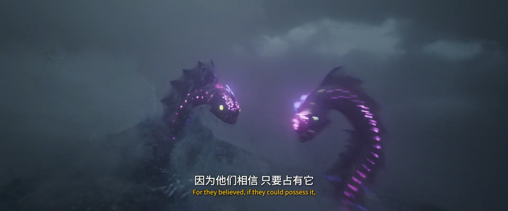

# 0.1.2-dev 同线路软件解码验证

日期：2026-09-12。用户要求在备用线路不可用时，仍可通过软件视频解码播放原线路。

## 实现

- 默认使用 Media3 / ExoPlayer。发现不支持的视频轨道、播放错误或前台等待首帧 40 秒后，先将原媒体地址、Referer、User-Agent、进度、速度和播放意图交给 libVLC。
- libVLC 3.6.5 禁用硬件解码，使用 avcodec 软件视频解码；通过 SimpleBasePlayer 接回原 PlayerView、MediaSession 和遥控器控件。网页解析、UI 布局和本地 SQLite 结构保持原有实现。
- libVLC 必须报告实际 displayedPictures 且存在视频尺寸和输出 Surface，才能宣告出画。仅有 Vout、可用时长或前进的播放时钟不算成功。
- 每条线路最多尝试一次原生和一次软解；软解失败或首帧超时后，才按集名匹配尚未尝试的其他线路。手动重试开启新一轮尝试。后台时间不计入首帧超时；切片、返回和销毁均取消旧尝试，原生回调按媒体事件编号核对归属。
- 暂停中切换时，软解器先静音显示一帧后暂停，保留跳转位置和速度；重新播放与音频焦点、后台暂停联动。已确认出画的活动线路才写入续播记录，签名媒体地址只保留在内存中。
- 其他架构采用 VLC Android 的非参考帧去块滤波跳过设置（skiploopfilter=1）；32 位 ARM 采用最多四线程、skiploopfilter=4 的优先流畅配置。后者关闭去块滤波，可能使压缩块更明显，但不主动跳过视频帧；分辨率仍为原片源分辨率。[上游参数依据](https://github.com/videolan/vlc-android/blob/master/application/resources/src/main/java/org/videolan/resources/VLCOptions.kt)
- 普通/全屏保持同一个视频 Surface，仅改变尺寸；修复真机切换布局时 libVLC 提前报告结束、误跳下一集的问题。额外校验结束时间，异常提前 EOF 进入恢复流程。回归同时检查媒体编号不变和显示帧继续增加。
- APK 按 ABI 拆分。该 Chromecast 为 32 位 armeabi-v7a，使用约 59 MiB 的对应 APK，避免安装包含所有 CPU 库的约 210 MiB 通用包。

## 最终版本验证

- JDK 17 / SDK 35：构建、21 项 Kotlin 单元测试与 lintDebug 通过，无单元测试失败或跳过。
- Chromecast / Android 14 / armeabi-v7a：最终安装包的 4 项实站回归通过，329.224 秒。包括《权力的游戏第八季》原 HD3 第 01 集软件首帧、连续一分钟吞吐、90 秒跳转、暂停换到 BD1 原生并切回 HD3 软解、保留进度与 1.25 倍速、收藏重新打开，以及《海洋奇缘：启航》首页默认 BD1 / HLS 出画与跳转。
- 真机全屏/普通布局回归检查切换前后媒体编号相同且继续显示帧，防止把重启播放或自动跳集误判为成功。原有收藏列表保持不变。
- API 34 / arm64 TV 模拟器：最终 6 项用例中，布局、两个反馈影片、HD7/HD2 双线路及遥控器布局共 5 项首轮通过；软件解码主用例首次在入口加载阶段超时（约 87 秒才进入解码恢复）。同一安装包仅重跑失败用例后通过，121.378 秒，连续 60.25 秒显示 1,439 帧、丢失 0 帧。首轮失败与复测报告均保留，未通过延长测试超时掩盖加载问题。
- 真机一分钟吞吐断言要求显示超过 1,000 帧、丢帧比例低于 15%，最终通过。最终运行的精确帧数日志在后续测试中已被系统轮转，故不将下表调优阶段的 1,443 / 13 误写为最终运行的精确计数。
- 调优阶段已确认 c2.amlogic.avc.decoder 与 c2.android.avc.decoder 均报告 AVC High 10（avc1.6E0032）不受支持；libVLC 实际显示了原 HD3 的 1920×1080 视频。

- 同一应用 APK 额外补验《海洋奇缘》：90 秒跳转后至少新增 49 个原生输出帧，32.222 秒通过。系统截图中的视频区域为黑色，但 PixelCopy 从同一 PlayerView 的视频 Surface 成功取得完整画面；两种原始采集都保留，不能用系统截图黑区判定硬解失败。

结果：[海洋奇缘视频输出补验](results/chromecast-moana-surface.txt)、[真机 4 项](results/chromecast-final.txt)、[模拟器首轮](results/emulator-suite.txt)、[模拟器单项复测](results/emulator-rerun.txt)、[复测帧数](results/emulator-metrics.txt)。

## 参数比较

| Chromecast 配置 | 显示帧 | 丢失帧 | 结果 |
| --- | ---: | ---: | --- |
| 原始默认软解 | 1,103 | 476 | 未通过 |
| OpenGL，非参考帧跳过滤波 | 1,224 | 346 | 未通过 |
| Android display 输出 | 240 | 915 | 未采用 |
| OpenGL，四线程，停用去块滤波 | 1,443 | 13 | 连续播放吞吐通过 |

这些是调优阶段同一设备、原 HD3 视频约一分钟区间的实测，不是整集或其他电视的性能保证。1,443 / 13 约为 0.9% 丢帧；当时吞吐通过但布局切换失败，随后修复 Surface 生命周期并通过上述最终回归。最终应用不暴露比较用的临时参数。

## 安装包与截图

- 已覆盖安装到用户的 Chromecast，包名 `com.libvio.tv`，versionCode `3`，版本 `0.1.2-dev`。没有清除本地收藏数据。
- ARM32 调试包：`artifacts/prototype/libvio-tv-0.1.2-dev-armeabi-v7a-debug.apk`，61,719,459 字节。
- 本地 APK 与电视安装的 `base.apk` 独立计算 SHA-256，均为 `721ee0f0e5fd255af91c452a9a24fc32592bd920706cbc89ac4b0957da0b16c8`。
- APK 为本地开发产物，未创建正式 Release；可按仓库构建步骤重建。证据清单见 [manifest.json](manifest.json)。
- 以下均来自最终应用在 Chromecast 上运行，未使用模拟器图代替真机。HD3 为 1920×1080 系统截图；海洋奇缘为 PixelCopy 直接采集的原生视频 Surface，单独显示且未合成进 UI 截图。关闭去块滤波后的压缩块也如实保留。







[同次系统截图：控件可见，硬件视频层未被采入](screenshots/moana-bd1-native.png)

## 重现

```sh
source scripts/android-env.sh
./gradlew assembleDebug assembleDebugAndroidTest testDebugUnitTest lintDebug
adb -s "$TV_SERIAL" install -r app/build/outputs/apk/debug/app-armeabi-v7a-debug.apk
adb -s "$TV_SERIAL" install -r app/build/outputs/apk/androidTest/debug/app-debug-androidTest.apk
adb -s "$TV_SERIAL" shell am instrument -w -r -e liveLibvio true \
  -e class com.libvio.tv.SoftwarePlaybackTest,com.libvio.tv.ReportedPlaybackTest \
  com.libvio.tv.test/androidx.test.runner.AndroidJUnitRunner
```

要求设备已收藏 routeId=5811975；真机测试不创建或删除收藏。模拟器可显式传 `-e seedEmulatorFavorite true`，此选项拒绝在真实设备使用。测试统计区间要求显示超过 1,000 帧，且丢帧比例低于 15%；不能以单帧截图代替这项检查。截图保存于 app external files 的 `verification/software-decoding`。

首帧恢复针对已解析媒体；未知 provider、解析失败、完整网络故障注入和所有软解失败组合尚未验收。尚未覆盖全站所有视频格式、整集长时间发热后的表现、API 26–29，以及主观听感和音画同步验收。流媒体可用性仍受站点与网络影响。
